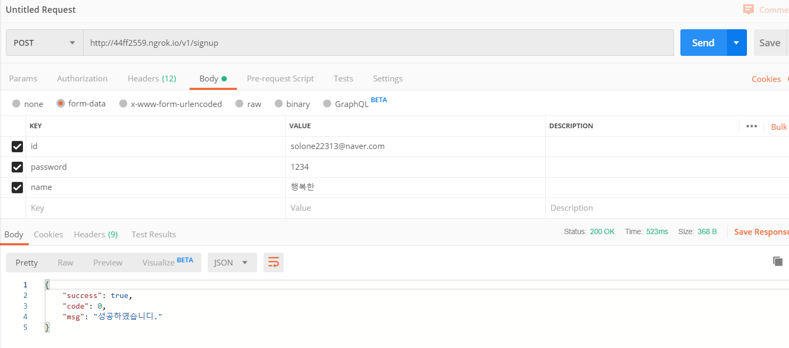
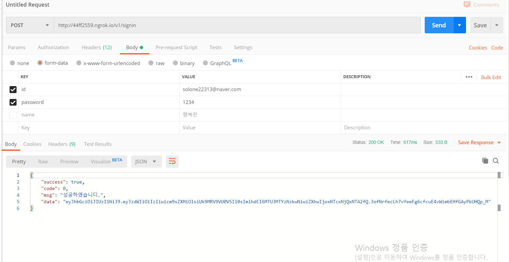
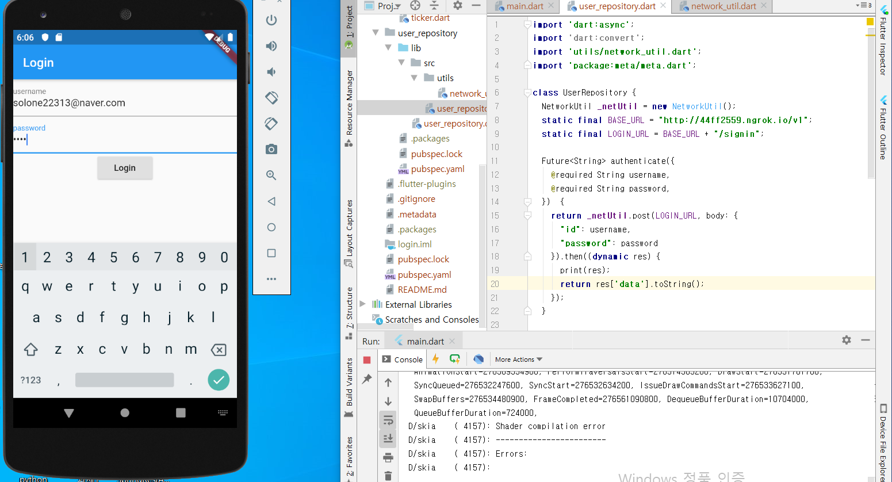
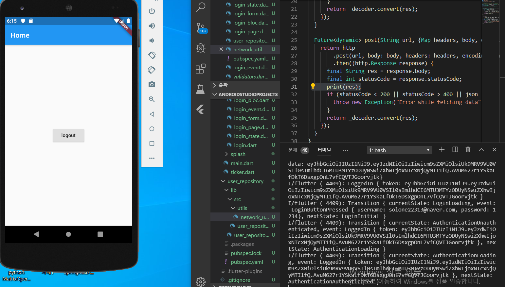

# login Project

A new Flutter project.

현재 signup 기능이 client에서 구현이 안되어 postman등을 사용하여 signup 해야합니다. (기말시험 종료후 바로 구현하겠습니다.)

## 공부 일정

10 / 14 : 플러터 공식 홈페이지를 통한 word 좋아요 기능 구현

10 / 15 : spring에 대한 기초 개념(with inflearn)확립

10 / 16 : bloc 패턴에 대한 이해와 bloc login과 todo어플을 구현

10 / 17 ~ 10 / 18 : 기말고사 공부

10 / 19 : spring rest api 개념 공부한 후 flutter http를 통한 통신 구현

10 / 20 : flutter http 통신과 spring boot rest api와의 연결 구축

10 / 21 : 최종 결과 테스트

이후에 signup 버튼과 signup 기능 구현
***
## login 프로젝트 개발계획
bloc 사이트의 flutter login project 정리 => spring boot jwt 토큰 반환 rest api 구현 => flutter login project와 spring boot 연결

***
### flutter login project

* User Repository

사용자 정보를 인증하고 검색하는 방법에 대한 기본적인 구현을 추상화하는 user_repository 구현. 

* Authentication States

1. 초기화되지 않음 - 앱 시작 시 사용자의 인증 여부 확인 대기 중
2. 로딩 - 토큰 유지/삭제 대기 중
3. 인증됨 - 성공적으로 인증됨
4. 인증되지 않음 - 인증되지 않음

위 네개의 인증 상태를 나타내는 상태 클래스를 구현한다.

여기서 equatable 패키지는 두 상태의 인스턴스를 비교하기 위해 사용된다.

* Authentication Events

AuthenticationState가 정의되었으므로 AuthenticationBloc가 응답할 AuthenticationEvents를 다음과 같이 정의해야 한다.

1. an AppStarted : 사용자가 현재 인증을 받았는지 여부를 확인해야 한다는 것을 블록에 알리기 위한 이벤트.
2. a LoggedIn : 사용자가 성공적으로 로그인했음을 블록에 알리는 이벤트.
3. a LoggedOut : 사람사용자가 성공적으로 로그아웃했음을 블록에 알리기 위한 이벤트.

여기서 @requried를 사용하기 위한 meta 패키지 사용.

* Authentication Bloc

AuthenticationState 및 AuthenticationEvents가 정의되었으므로 AuthenticationBloc을 구현하여 AuthenticationEvents에 대응하여 사용자의 AuthenticationState 확인 및 업데이트를 관리할 수 있다.

* splash page

먼저 AuthenticationBloc에서 사용자의 로그인 여부를 결정하는 동안 SplashPage 위젯이 우리의 Splash 화면 역할을 할 것이다.

* home page

다음으로, 우리는 홈페이지를 만들어 사용자가 로그인한 후에 그 곳을 탐색할 수 있도록 해야 할 것이다.

* http

중요한 http 통신을 만들 차례입니다. flutter의 http 패키지를 이용하여 post와 get의 future 메소드를 network_util.dart에 구현했고, 이 통신을 확인하기 위해 ngrok을 이용하여 확인했습니다. 이후 user_repository에 연결했습니다.

### spring boot rest api

api 구축은 다음 url을 참조하였습니다.
https://daddyprogrammer.org/post/636/springboot2-springsecurity-authentication-authorization/

h2 database를 사용하였고, gradle로 build 하였습니다.

spring과 flutter에 대한 지식이 모두 전무했기 때문에 지속적으로 공부하여 어플을 발전시키겠습니다.

*** 

## how to run

1. spring boot의 경우 https://daddyprogrammer.org/post/1215/intellij-github-spring-gradle-project-import/ 에서처럼 build하고 실행시켰습니다.

2. 이후 spring boot에서 지정된 포트번호 8080으로 ngrok을 설정해야 줬습니다.

3. server가 실행되고 난 후에 postman을 이용하여 회원가입을 진행했습니다. 

4. 다음으로 server에 제대로 signup이 되었는지 확인했습니다.

5. client에서 flutter를 실행 시킨 후에 로그인 페이지를 띄웠습니다.

6. 마지막으로 로그인이 성공적으로 되고나서 token값이 콘솔창에 띄워지는 것을 확인하고 종료하였습니다.

